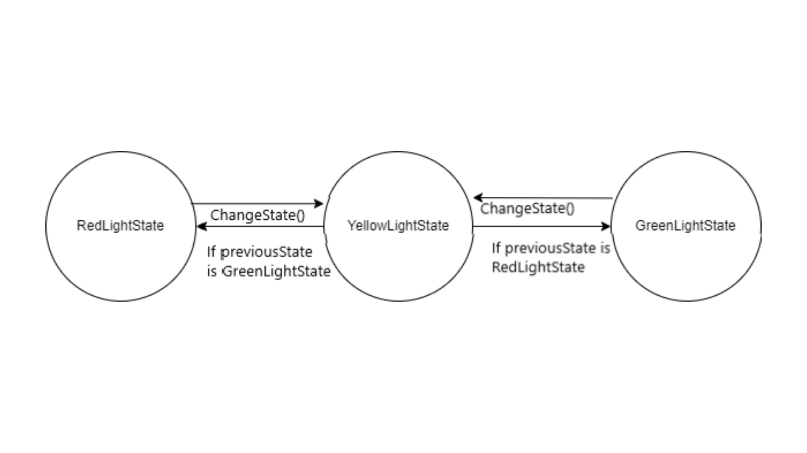
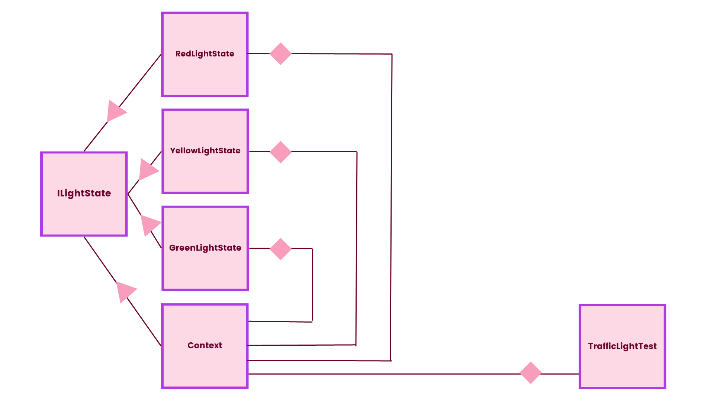

# TrafficLightStateMachine

This is a C# project that simulates a traffic light implemented using state design pattern. The project consists of several classes representing the states of a traffic light and a context class that manages the transitions between these states. 

## Project Structure

The project is organized as follows:

- **LightStateMachine**: This namespace contains the core classes for the traffic light state machine.
  - `ILightState.cs`: Defines the interface for a traffic light state.
  - `Context.cs`: Represents the context of a traffic light and manages its state transitions.
  - `GreenLightState.cs`: Represents the state of a traffic light when it's green.
  - `RedLightState.cs`: Represents the state of a traffic light when it's red.
  - `YellowLightState.cs`: Represents the state of a traffic light when it's yellow.

- **UnitTest**: This namespace contains unit tests for the traffic light state machine.
  - `TrafficLightTest.cs`: Contains unit tests to verify the functionality of the state transitions.

## States
 - `RedLightState`: Light is Red, only possible transition is to YellowLightState.
  - `GreenLightState`: Light is Red, only possible transition is to YellowLightState.
  - `YellowLightState`: Light is Yellow, based on previous state, switch to either Red or Green.
## Design

### State Diagram

### Dependency Diagram

